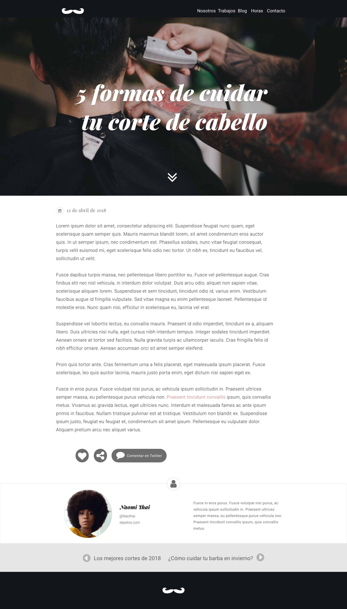
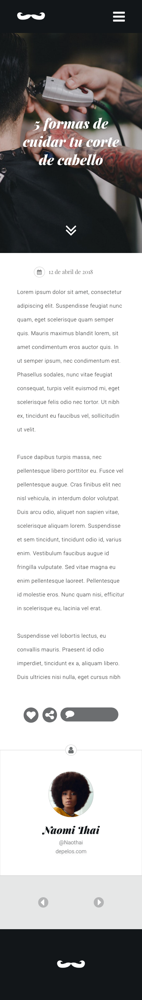

## -Requisitos generales
 - Una barra de navegación y un footer. Cada uno mostrando el logo.  - Cuatro secciones definiendo el nombre de las clases:
  - Sección "Header" donde se mostrará un título y una foto de fondo.
  - Sección "Texto" donde muestre el artículo relacionado al título.
  - Sección "Contancto" donde muestre el contacto de la persona que escribe el artículo.
  - La página debe ser responsiva.

## -Requisitos específicos
- Íconos que permitan reccionar al artículo.
 - *Usar "font awesome"*.
- Secciones con grilla
 - *Usar "bootstrap"*.
- Párrafos en general
 - *Se usará "lorem ipsum"*. 
 
##-Requisitos visuales

- Layout:
 - *Usar Bootstrap*.
- Fuentes *(Usar fuentes entregadas por diseñador del mockup que están en la guía de estilos*)
 
## -Especificación de clases

- Barra de navegación:
 - clase: navbar__navigation para el navbar
 - clase: navbar_barbershop para el nav
 - clase logo-bigote
- Sección Header 
 - clase header__barbershop
 - clase flechas-bottom para el botón de flechas
- Sección Texto
 - clase fecha-calendar para sección general
 - clase fecha y clase calendar
 - clase text-all para todo el artículo
 - clase iconos para los íconos interactivos
- Sección Contatcto
 - clase naomi
 - foto-naomi
 - text naomi
- Otros Artículos
 - clase otros
- Footer
 - clase footer_barbershop
 - clase logo-bigote-footer

## Mockup del sitio entregado por el cliente

## Diseño para Desktop

## Diseño para dispositivos móviles

# MAQUETADO
